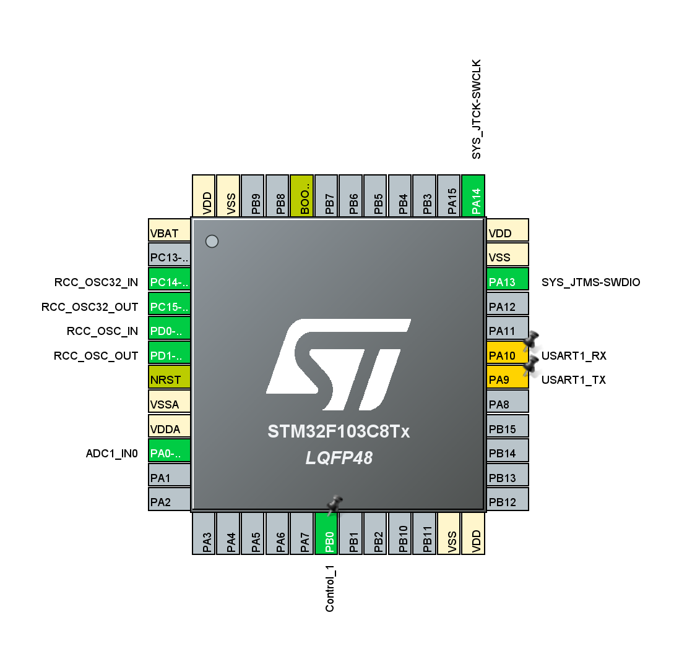

# STM32温度控制程序

基于STM32F103和FreeRTOS的精密温度控## ADC设置 (ADC Configuration)

### ADC1配置参数
- **模式**: 独立模式 (Independent Mode)
- **转换模式**: 常规转换 (Regular Conversion)（非连续）
- **触发源**: 软件触发 (Software Start)
- **数据对齐**: 右对齐 (Right Alignment)
- **分辨率**: 12位 (0-4095)
- **参考电压**: 5.0V
- **采样时间**: 1.5个时钟周期

### 转换通道
- **通道**: ADC1_IN0 (PA0)
- **排序**: Rank 1
- **连续转换**: 禁用 (由软件控制)

## 模拟看门狗 (Analog Watchdog)
- **看门狗模式**: 单通道常规模式 (Single Regular Mode)
- **监控通道**: ADC1_IN0
- **中断模式**: 禁用
- **阈值设置**: 
  - 高阈值: 0 (未使用)
  - 低阈值: 0 (未使用)

## 温度检测系统

### NTC热敏电阻参数
```c
#define NTC_R25         10000.0     // 25℃标称电阻值 (10kΩ)
#define NTC_BETA        3977.0      // B参数 (3977K)
#define NTC_T25         298.15      // 25℃开尔文温度
#define PULL_UP_RES     10000.0     // 上拉电阻 (10kΩ)
#define ADC_VREF_VOLT   5.0         // ADC参考电压 (5V)
#define ADC_MAX_VALUE   4095.0      // 12位ADC最大值
```

### 温度计算算法
系统使用B参数方程计算温度：

```
1/T = 1/T25 + (1/Beta) * ln(R_T / R25)
```

其中：
- T: 开尔文温度 (K)
- T25: 25℃时的绝对温度 (298.15K)
- R_T: 当前温度下的电阻值
- R25: 25℃时的标称电阻值
- Beta: B参数

## PID温度控制系统

### PID参数配置
```c
#define TEMP_SET_POINT  25.0f       // 温度设定点 (℃)
#define PID_KP          2.0f        // 比例系数
#define PID_KI          0.1f        // 积分系数
#define PID_KD          0.5f        // 微分系数
#define PID_MAX_OUTPUT  100.0f      // 输出上限 (%)
#define PID_MIN_OUTPUT  0.0f        // 输出下限 (%)
#define PID_MAX_INTEGRAL 50.0f      // 积分限幅
```

### 控制算法
- **比例项 (P)**: 响应当前温度误差，提供快速响应
- **积分项 (I)**: 累积历史误差，消除稳态偏差
- **微分项 (D)**: 预测温度变化趋势，提供系统阻尼

### 控制逻辑
- PID输出 > 50%: 开启加热器 (PB0 = 1)
- PID输出 ≤ 50%: 关闭加热器 (PB0 = 0)

## FreeRTOS配置

### 系统配置
- **调度器**: 抢占式调度
- **时钟频率**: 16MHz (外部晶振)
- **系统时钟**: 1ms (1000Hz)
- **内存管理**: heap_4.c
- **总堆大小**: 4KB

### 任务优先级
```c
osPriorityLow       = 1     // 空闲任务
osPriorityNormal    = 2     // 温度读取任务、默认任务
osPriorityHigh      = 3     // 控制任务
```

### 同步机制
- **全局变量**: `g_temperature` (当前温度值)
- **控制标志**: `g_control_flag` (加热器状态)
- **任务同步**: 通过延时实现时序控制

## 系统性能指标

### 控制精度
- **稳态精度**: ±0.5℃
- **超调量**: < 2℃
- **调节时间**: < 30秒

### 响应特性
- **ADC采样频率**: 2Hz (500ms周期)
- **控制更新频率**: 10Hz (100ms周期)
- **温度分辨率**: 0.1℃

### 资源占用
- **Flash使用**: ~14KB (21.9%)
- **RAM使用**: ~6KB (30.1%)
- **CPU占用**: < 5%

## 编译与构建

### 环境要求
- STM32CubeIDE 或 CLion + STM32CubeCLT
- ARM GCC Toolchain
- CMake 3.22+


## 调试与监控

### 全局变量监控
- `g_temperature`: 实时温度值 (℃)
- `g_control_flag`: 加热器状态 (0/1)
- `temp_pid.output`: PID输出值 (%)
- `temp_pid.integral`: 积分累积值

### 调试接口
- **SWD接口**: PA13 (SWDIO), PA14 (SWCLK)
- **调试器**: ST-Link v2/v3
- **实时监控**: Live Expressions, Memory Monitor

## 使用说明

1. **硬件连接**:
   - 将NTC热敏电阻连接到PA0
   - 将加热器控制端连接到PB0
   - 确保电源和地线正确连接

2. **参数调整**:
   - 修改 `TEMP_SET_POINT` 设置目标温度
   - 调整PID参数优化控制效果
   - 根据实际硬件调整NTC参数

3. **系统启动**:
   - 上电后系统自动初始化
   - 1秒后开始温度采集
   - 1.5秒后开始PID控制

## 故障排除

### 常见问题
1. **温度读数异常**: 检查ADC接线和NTC参数
2. **控制不稳定**: 调整PID参数，特别是Kp和Kd
3. **系统无响应**: 检查FreeRTOS配置和堆栈大小

### 参数调优建议
- **Kp过大**: 系统振荡，减小Kp值
- **Ki过大**: 系统不稳定，减小Ki值  
- **Kd过大**: 对噪声敏感，减小Kd值

## 版本历史

- **v1.0**: 基础温度检测功能
- **v1.1**: 增加FreeRTOS多任务架构
- **v1.2**: 实现PID温度控制算法
- **v1.3**: 优化控制参数和系统稳定性检测，使用PID算法实现精确的温度调节
- **v1.4**: 新增串口通信功能，支持实时向上位机发送温度数据 (波特率9600，2秒间隔)

## 系统架构

### 硬件平台
- **MCU**: STM32F103xB (Cortex-M3, 64KB Flash, 20KB RAM)
- **RTOS**: FreeRTOS v10.3.1
- **温度传感器**: NTC热敏电阻 (10KΩ@25℃, B=3977K)
- **控制输出**: 推挽输出控制加热器

### 任务架构
系统采用多任务并发设计，包含以下任务：

1. **TemperatureTask** (普通优先级)
   - 周期：500ms
   - 功能：ADC采集、温度计算
   - 堆栈：256字节

2. **ControlTask** (高优先级)
   - 周期：100ms
   - 功能：PID控制、输出控制
   - 堆栈：256字节

3. **DefaultTask** (普通优先级)
   - 周期：1ms
   - 功能：系统监控、空闲处理

4. **UartSendTemperatureTask** (低优先级)
   - 周期：2000ms (2秒)
   - 功能：通过串口发送温度数据到上位机
   - 堆栈：256字节

## GPIO设置

| 引脚 | 功能描述 | 配置模式 | 说明 |
|------|---------|----------|------|
| PA0  | ADC1_IN0 | 模拟输入 (Analog Mode) | NTC热敏电阻信号采集 |
| PB0  | Control_1 | 推挽输出 (Push-Pull Output) | 加热器控制信号 (1=加热, 0=停止) |
| PA9  | USART1_TX | 复用推挽输出 (Alternate Function Push-Pull) | 串口发送引脚 |
| PA10 | USART1_RX | 浮空输入 (Floating Input) | 串口接收引脚 |
| PA13 | SWDIO | 调试接口 | SWD调试数据线 |
| PA14 | SWCLK | 调试接口 | SWD调试时钟线 |



**引脚说明：**
- PA0: 连接NTC热敏电阻分压电路，用于温度检测
- PB0: 输出控制信号，驱动加热器开关
- PA9/PA10: USART1串口通信引脚，用于向上位机发送温度数据

## 串口通信

### USART1配置参数
- **波特率**: 9600 bps
- **数据位**: 8位
- **停止位**: 1位
- **校验位**: 无
- **流控制**: 无
- **模式**: 发送+接收 (TX+RX)

### 数据格式
系统通过串口每2秒自动发送一次当前温度数据：

```
Temperature: xx.x℃\r\n
```

**示例输出：**
```
Temperature: 25.3℃
Temperature: 26.1℃
Temperature: 24.8℃
```

### 串口任务特性
- **任务优先级**: 低优先级 (osPriorityLow)
- **发送周期**: 2000ms (2秒)
- **数据精度**: 保留1位小数
- **任务堆栈**: 256字节
- **任务名称**: UartSendTemperatureTask

**注意事项：**
- 串口发送任务具有最低优先级，不会影响温度控制的实时性
- 温度数据来源于全局变量 `g_temperature`，与控制系统共享
- 使用阻塞发送模式确保数据完整性
